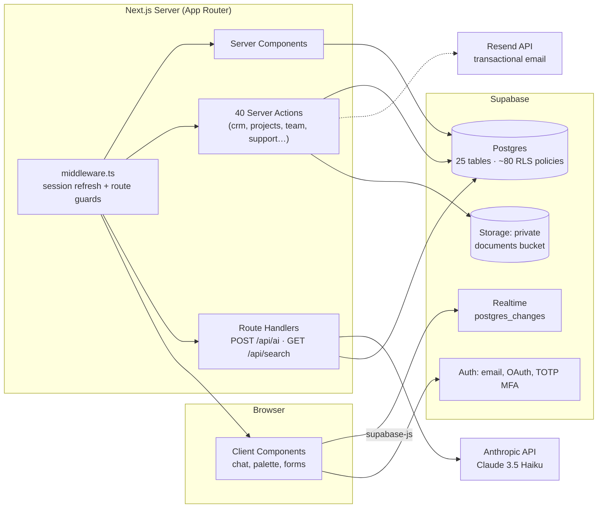

<div align="center">

# Merkato

**The all-in-one operating system for your startup.**

CRM · Projects · Team Chat · Knowledge Base · Customer Support · Documents · Analytics · AI Assistant

[](https://nextjs.org)
[](https://www.typescriptlang.org)
[](https://supabase.com)
[](https://tailwindcss.com)
[](https://vitest.dev)
[](.github/workflows/ci.yml)
[](LICENSE)

</div>

---

Merkato replaces four separate SaaS subscriptions — a CRM, a project tracker, a team chat, and a helpdesk — with **one codebase, one workspace, one login**. Every module shares the same database, the same permissions, and the same activity stream, so nothing falls through the cracks between tools.

Built for fast-moving startup teams that want Linear-quality focus with Supabase-grade data safety: **Row Level Security enforces tenancy at the database itself**, not just in application code.

> [!NOTE]
> **Navigation** — [Features](#-key-features) · [Roles](#-user-roles) · [Architecture](#-architecture) · [Database](#-database-design) · [API](#-api-overview) · [Getting Started](#-getting-started) · [Env Vars](#-environment-variables) · [Testing](#-testing) · [Deployment](#-deployment) · [Security](#-security) · [FAQ](#-faq)

---

## ✨ Key Features

| Module | What you get | Status |
|---|---|---|
| **Dashboard** | Live pipeline value, won revenue, contact counts, recent deals & workspace activity feed | ✅ |
| **CRM** | Companies, contacts, and a 6-stage deal pipeline (New Lead → Won/Lost) with drag-and-drop | ✅ |
| **Projects** | Board / List / Calendar views, subtasks, comments, priorities, assignees, task detail panel | ✅ |
| **Team Collaboration** | Org channels + direct messages over **realtime** websockets, member directory, activity log | ✅ |
| **Knowledge Base** | Markdown articles (custom XSS-safe renderer), categories, tags, draft → publish workflow | ✅ |
| **Customer Support** | Staff ticket queue **and** a separate public customer portal at `/portal/<org-slug>` — internal notes are hidden from customers *at the RLS level* | ✅ |
| **Documents** | Drag-drop uploads to private storage, folders, version history, signed download URLs | ✅ |
| **Analytics** | Business / Team / Support dashboards rendered with hand-rolled SVG charts (**zero chart dependencies**) | ✅ |
| **Command Palette** | `⌘K` anywhere — fuzzy navigation plus **live search** across companies, contacts, deals, tasks, articles & tickets | ✅ |
| **AI Assistant** | Org-aware streaming chat powered by Claude 3.5 Haiku, injected with live workspace context | ✅* |
| **Notifications** | Realtime notification bell; events for assignments, replies, invites | ✅ |
| **Audit Log** | Compliance-grade event trail (owners/admins only) | ✅ |
| **Invitations** | Email invitations with single-use tokens (7-day expiry), accepted via `/invite/<token>` | ✅ |
| **MFA** | TOTP two-factor auth (Google Authenticator, Authy, 1Password…) | ✅ |
| **OAuth** | Google + GitHub sign-in buttons (auto-hidden until providers are configured) | ✅* |
| **Weekly digest** | Cron job (`/api/cron/weekly-digest`, Mondays 09:00 UTC via `vercel.json`) emails staff a summary of open deals/tasks/tickets | ✅ |
| **Rate limiting** | Per-user fixed-window limits on both API routes (60/min search, 20/min AI) | ✅ |

<sub>\* Works out of the box once the corresponding API key is added to `.env.local`. Without keys, features degrade gracefully — never crash.</sub>

---

## 👥 User Roles

Tenancy is enforced by a single enum on every membership row:

```sql
create type public.org_role as enum ('owner', 'admin', 'member', 'customer');
```

| Capability | Owner | Admin | Member | Customer |
|---|:-:|:-:|:-:|:-:|
| Access internal app (dashboard, CRM, projects, …) | ✅ | ✅ | ✅ | ❌ *(redirected to portal)* |
| Create/edit/delete CRM, projects, docs, KB | ✅ | ✅ | ✅ | ❌ |
| Reply to tickets / see internal notes | ✅ | ✅ | ✅ | ❌ *(RLS-enforced)* |
| View analytics | ✅ | ✅ | ✅ | ❌ |
| Invite & remove members, manage invitations | ✅ | ✅ | ❌ | ❌ |
| Update workspace settings | ✅ | ✅ | ❌ | ❌ |
| View audit log | ✅ | ✅ | ❌ | ❌ |
| Submit & reply to their own tickets (portal) | — | — | — | ✅ |

Customers self-enroll into an organization's portal via the SQL function `join_org_as_customer(org_slug)` and can **only ever** query tickets where `customer_id = auth.uid()` — guaranteed by policy, not by UI.

---

## 🖼 Screenshots

Captured against a live instance (regenerate anytime with `scripts/screenshot.mjs` — see the header of that file for usage):

| | |
|---|---|
|  |  |
| *Live metrics & workspace activity* | *⌘K searching real CRM records* |
|  |  |
| *Deal pipeline* | *Task board* |
|  |  |
| *Realtime channels* | *Ticket queue* |

More in [`docs/screenshots/`](docs/screenshots): `login.png`, `signup.png`, `analytics.png`.

---

## 🏛 Architecture



**Layering rules**

- Pages fetch data in Server Components via typed Supabase queries; mutations go exclusively through `"use server"` actions — **47 across 9 modules**.
- Cross-cutting concerns are thin, fire-and-forget-safe helpers: `logActivity()`, `notify()`, `auditLog()` — they swallow their own errors so logging never breaks a user action.
- Route guards: `requireOrgContext()` (auth + membership) and `requireStaffContext()` (additionally blocks the `customer` role, redirecting to the portal).
- Generated database types (`types/database.generated.ts`) flow through every client, so joins like `profiles(full_name)` are compile-time checked.

## 🧰 Tech Stack

| Layer | Choice | Notes |
|---|---|---|
| Framework | [Next.js 14](https://nextjs.org) (App Router) + React 18 | patched 14.2 line |
| Language | TypeScript (strict) | generated DB types everywhere |
| Styling | Tailwind CSS 3.4 | custom dark-mode-first token system, motion tokens, `prefers-reduced-motion` respected |
| Database | Supabase Postgres | RLS-first multi-tenancy |
| Auth | Supabase Auth | email/PKCE · OAuth · TOTP MFA |
| Realtime | Supabase Realtime | chat + notifications |
| Storage | Supabase Storage | private bucket, signed URLs |
| AI | Anthropic Messages API | direct REST, streamed SSE→plain text |
| Email | Resend REST API | zero SDK dependencies |
| Icons | lucide-react | only UI dependency besides clsx/tailwind-merge |
| Tests | Vitest | pure-function units incl. XSS escape guarantees |

Deliberately **not** used: chart libraries, markdown parsers, form libraries, state managers, CSS component kits — each replaced with a small verified in-repo implementation.

---

## 🗄 Database Design

25 tables, organized by domain (all carrying `organization_id` unless user-scoped):

| Domain | Tables |
|---|---|
| Core | `profiles` · `organizations` · `organization_members` |
| CRM | `crm_companies` · `crm_contacts` · `crm_deals` · `crm_notes` |
| Projects | `projects` · `project_tasks` · `task_subtasks` · `task_comments` |
| Collaboration | `channels` · `channel_members` · `messages` · `activity_log` |
| Knowledge | `kb_categories` · `kb_articles` |
| Support | `support_tickets` · `ticket_messages` |
| Documents | `document_folders` · `documents` · `document_versions` |
| Platform | `notifications` · `audit_logs` · `invitations` |

**Enforcement lives in Postgres** (migrations in [`supabase/migrations/`](supabase/migrations), run in numeric order):

- ~90 Row Level Security policies — including the customer/internal-note split
- `SECURITY DEFINER` helpers: `is_org_member()`, `current_org_role()`, `handle_new_user()` trigger (auto-creates profiles), `join_org_as_customer()`, `accept_invitation()`, `get_user_email()`, `get_org_staff_emails()`
- `touch_updated_at()` trigger keeps `updated_at` honest on CRM rows
- Private storage bucket `documents` with owner-scoped object policies
- Enums: `org_role`, `deal_stage`, `task_status/priority`, `ticket_status/priority`, `article_status`, `activity_type`

---

## 🔌 API Overview

Two route handlers complement the server-action surface:

| Endpoint | Method | Auth | Description |
|---|---|---|---|
| `/api/ai` | POST | session required | Streams Claude responses (plain-text chunks). Body `{ messages[], context? }`; last 20 messages kept; returns 500 with clear message when `ANTHROPIC_API_KEY` absent |
| `/api/search` | GET | session required (401 otherwise) | Org-scoped `ilike` search across 7 tables; returns grouped results; min 2 chars; PostgREST filter input sanitized; 60 req/min per user |
| `/api/cron/weekly-digest` | GET | `Authorization: Bearer CRON_SECRET` | Scheduled weekly summary email to org staff; requires service-role key; scheduled via `vercel.json` |

Everything else is **Server Actions** (no REST surface): `createDeal`, `updateDealStage`, `createTask`, `sendMessage`, `staffReply`, `uploadDocument`, `sendInvitation`, `joinOrgAsCustomer`, … — full inventory in each module's `actions.ts`.

Rate limiting: per-user fixed-window limits via `lib/rate-limit.ts` — **60 req/min** on `/api/search`, **20 req/min** on `/api/ai` (in-memory, per instance; swap in a shared store for multi-instance scale). CSRF: covered by SameSite=Lax cookies + Next.js server-action origin checks. Validation: manual per-action checks (no schema library).

---

## 🚀 Getting Started

### Prerequisites

| Tool | Version |
|---|---|
| Node.js | ≥ 18.18 (LTS recommended) |
| npm | ≥ 9 |
| A [Supabase](https://supabase.com) project | free tier works |
| *(optional)* [Anthropic](https://console.anthropic.com) + [Resend](https://resend.com) keys | unlock AI & email |

### Installation

```bash
git clone https://github.com/YOUR_GITHUB_USERNAME/merkato.git
cd merkato
npm install
cp .env.local.example .env.local   # then fill it in (see below)
```

### Environment Variables

| Variable | Required | Purpose |
|---|:-:|---|
| `NEXT_PUBLIC_SUPABASE_URL` | ✅ | Project URL (Settings → API) |
| `NEXT_PUBLIC_SUPABASE_ANON_KEY` | ✅ | anon/public key — safe for browsers, scoped by RLS |
| `NEXT_PUBLIC_APP_URL` | ✅ | e.g. `http://localhost:3000`; used in emails/invites |
| `ANTHROPIC_API_KEY` | – | enables the AI Assistant |
| `RESEND_API_KEY` + `EMAIL_FROM` | – | enables invitations & notification emails |
| `NEXT_PUBLIC_GOOGLE_OAUTH_ENABLED=true` | – | reveals Google button |
| `NEXT_PUBLIC_GITHUB_OAUTH_ENABLED=true` | – | reveals GitHub button |

> [!IMPORTANT]
> Provisioning the database is a required manual step:
> run the 12 SQL files from [`supabase/migrations/`](supabase/migrations) **in numeric order** in the Supabase SQL Editor (note: `006a` must complete before `006b` — enum values must commit separately),
> then create a **private** Storage bucket named exactly `documents`.
> Full click-by-click walkthrough: [`SETUP_GUIDE.md`](SETUP_GUIDE.md).

### Running Locally

```bash
npm run dev        # http://localhost:3000
```

First-run experience: `/signup` → confirm email → create your workspace → you own the first `owner` membership. In Supabase Dashboard set **Authentication → URL Configuration → Site URL** to `http://localhost:3000` so confirmation links land back on your dev server.

### Development Workflow

```bash
npm run dev         # dev server
npm run lint        # eslint (next/core-web-vitals)
npx tsc --noEmit    # typecheck
npm test            # vitest suite
npm run build       # production build (hermetic — no secrets needed to compile)
```

Regenerate database types after any migration:

```bash
SUPABASE_ACCESS_TOKEN=<token> npx supabase gen types typescript \
  --project-id <ref> --schema public > types/database.generated.ts
```

## 🧪 Testing

Current state (honest scope): **unit tests only**, focused on the pure logic layers where regressions are silent.

```bash
npm test          # run once (CI-friendly)
npm run test:watch
```

| Suite | Covers |
|---|---|
| `tests/utils.test.ts` | class merging (`cn`), Supabase join unwrapping (`joinedRow`) |
| `tests/markdown.test.ts` | headings/lists/links rendering + **HTML-escape (XSS) guarantees** for inline and fenced code |

Gaps, tracked in the roadmap: integration tests against a local Supabase, Playwright e2e flows, coverage reporting.

## ☁️ Deployment

Optimized for **Vercel** (zero-config for Next.js 14):

1. Push to GitHub → import repo in Vercel
2. Add every env var from the table above (production values)
3. Deploy
4. In Supabase: update **Site URL** + redirect allow-list to your production domain, re-enable **Confirm email**, and point OAuth callback URLs at `https://<ref>.supabase.co/auth/v1/callback`
5. Set `NEXT_PUBLIC_APP_URL` to the final URL and redeploy

No Dockerfile yet; CI runs on **GitHub Actions** (`.github/workflows/ci.yml`): typecheck → lint → unit tests → hermetic production build on every push/PR. Any Node host works for deployment.

## 🔒 Security

| Concern | Implementation |
|---|---|
| Tenancy | RLS on every table via `organization_id` + `is_org_member()` — the database refuses cross-workspace reads/writes even if app code is buggy |
| Sessions | httpOnly Supabase cookies, refreshed by middleware using `auth.getUser()` (server-verified) |
| Passwords | Supabase Auth (bcrypt inside GoTrue); PKCE-signed recovery links |
| MFA | TOTP challenge enforced post-login before session use |
| Customer isolation | `customer` role blocked from internal routes *and*, critically, from internal-note rows by policy |
| Uploads | private bucket; access only through owner-scoped policies + short-lived signed URLs |
| Rate limiting | 60/min (search) and 20/min (AI) per authenticated user on API routes; cron endpoint locked behind `CRON_SECRET` bearer auth |
| XSS | all user HTML escapes through `lib/markdown.ts` (unit-tested); React escaping elsewhere |
| Secrets | server-only env vars never prefixed `NEXT_PUBLIC_`; `.env*.local` gitignored |

Known gaps → [Roadmap](#-roadmap): shared-store rate limiting for multi-instance deployments, request-schema validation library, security headers config.

## 🤝 Contributing

See [`CONTRIBUTING.md`](CONTRIBUTING.md) for setup, architecture rules, database-change workflow, and the pre-PR checklist. By contributing you agree your contributions are licensed under the [MIT License](LICENSE).

## 🗺 Roadmap

Ordered by what the codebase is already shaped for:

1. Shared-store rate limiting (Redis/Upstash) for multi-instance deployments
2. Integration tests against local Supabase + Playwright e2e flows
3. Dockerfile + container deploy path
4. Light theme (tokens already dual-defined in `tailwind.config.ts`)
5. Schema-validation library (e.g. Zod) for server actions
6. Realtime presence in team chat

## ❓ FAQ

<details>
<summary><b>Why does clicking an OAuth button do nothing?</b></summary>
Buttons render only when <code>NEXT_PUBLIC_*_OAUTH_ENABLED=true</code>. Enable the providers in Supabase first, then set the flags.
</details>

<details>
<summary><b>Emails aren't sending.</b></summary>
Set <code>RESEND_API_KEY</code> + <code>EMAIL_FROM</code>. Without them emails skip silently — the app still works. Password-reset/verification mail is always sent by Supabase itself.
</details>

<details>
<summary><b>Confirmation link says "site can't be reached".</b></summary>
Your Supabase Site URL doesn't match where the app runs. Dashboard → Authentication → URL Configuration → set Site URL (e.g. <code>http://localhost:3000</code>) and allow-list <code>http://localhost:3000/**</code>.
</details>

<details>
<summary><b>The 006a/006b split?</b></summary>
Postgres requires <code>ALTER TYPE ... ADD VALUE</code> to commit alone; running both files together raises “unsafe use of new value”. Run them as separate statements.
</details>

<details>
<summary><b>Can customers see staff-only ticket notes?</b></summary>
No — enforced by RLS (<code>ticket_messages</code> customer policy filters <code>is_internal</code>), independent of the UI.
</details>

<details>
<summary><b>How does the weekly digest work?</b></summary>
A scheduled job calls <code>GET /api/cron/weekly-digest</code> (Vercel Cron: Mondays 09:00 UTC, defined in <code>vercel.json</code>). It requires <code>CRON_SECRET</code> (sent as a bearer token) and <code>SUPABASE_SERVICE_ROLE_KEY</code> to enumerate organizations across tenants. Without Resend keys it reports what it <em>would</em> send instead of failing.
</details>

## 📄 License

Released under the [MIT License](LICENSE).

## 🙏 Acknowledgements

- [Supabase](https://supabase.com) — Postgres, Auth, Realtime, Storage
- [Next.js](https://nextjs.org) & [Vercel](https://vercel.com)
- [Anthropic](https://anthropic.com) — Claude powering the assistant
- [Resend](https://resend.com) — transactional email
- [lucide](https://lucide.dev) — icon set

---

<div align="center">
<sub>Built with Next.js 14, Supabase, Claude, and an unreasonable dislike of tab-switching.</sub>
</div>
