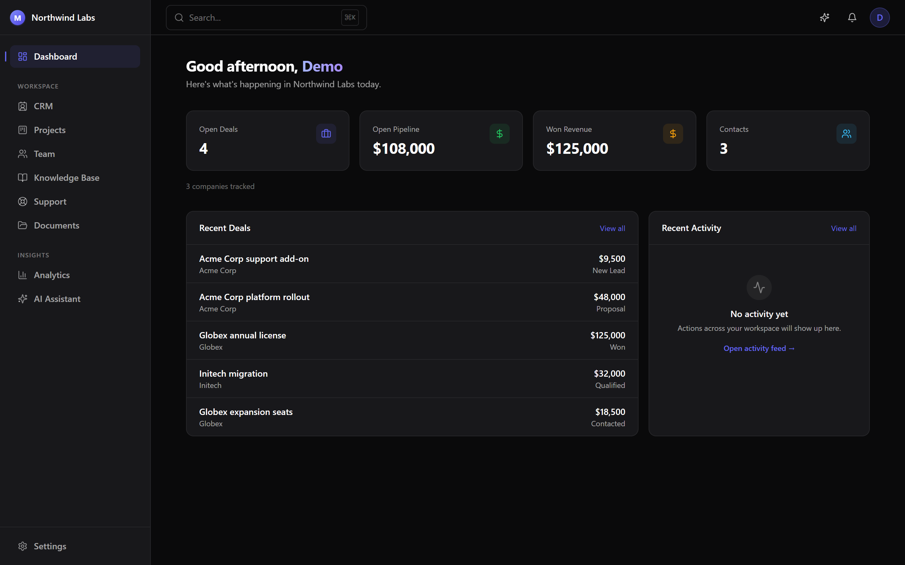
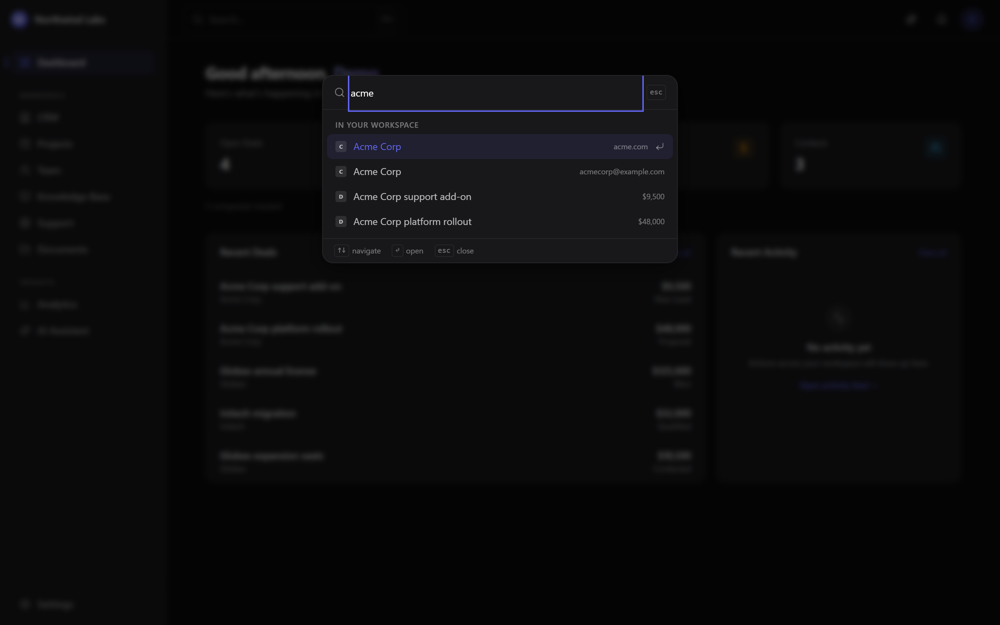
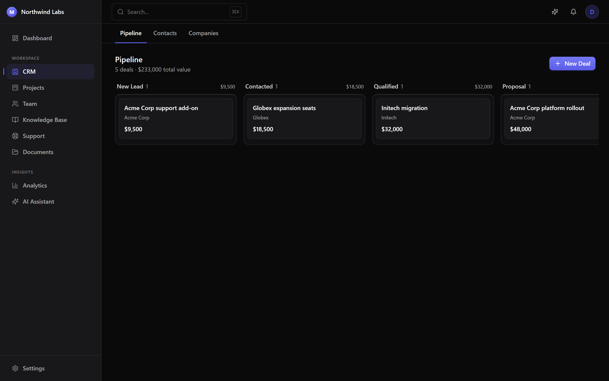
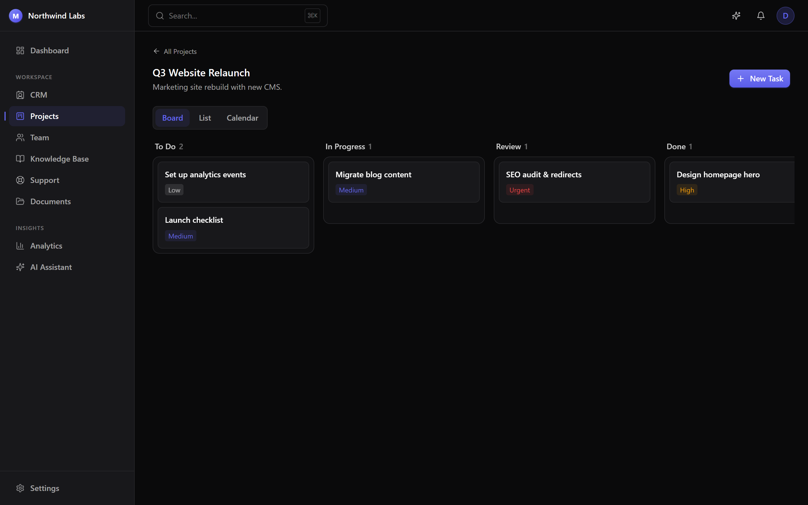
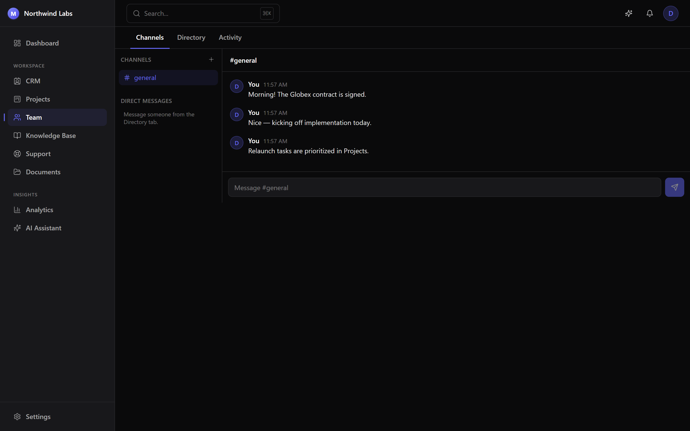
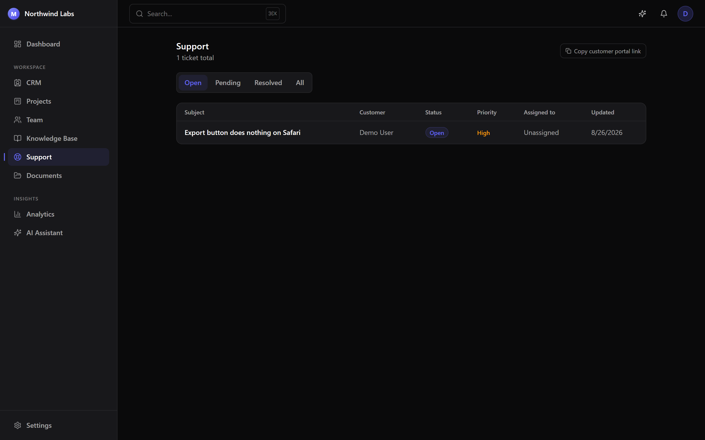
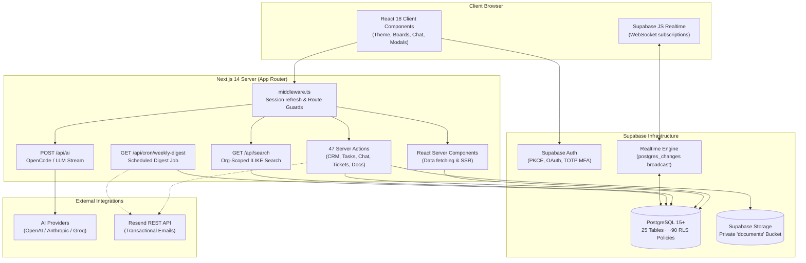
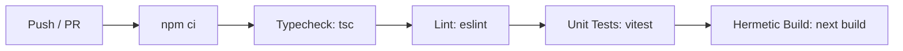

<div align="center">

# Merkato

**The unified operating system for high-velocity startups.**

CRM Pipeline · Sprint Task Boards · Team Channels · Knowledge Base · Customer Support Helpdesk · Document Drive · Analytics · AI Assistant

[](https://nextjs.org)
[](https://www.typescriptlang.org)
[](https://supabase.com)
[](https://tailwindcss.com)
[](https://vitest.dev)
[](.github/workflows/ci.yml)
[](LICENSE)

</div>

---

Merkato replaces fragmented, expensive SaaS subscriptions — customer relationship management, agile sprint task tracking, real-time team messaging, document storage, and customer support ticketing — with **one codebase, one real-time database, and one login**. 

Built for agile teams that prioritize operational velocity, database-enforced security, and zero-context-switching workflows: **Postgres Row-Level Security (RLS) guarantees tenant and role isolation at the database layer**, not solely within application routing.

> [!NOTE]
> **Table of Contents**
> 1. [Project Overview](#1-project-overview) · 2. [Problem Statement](#2-problem-statement) · 3. [Why This Project Exists](#3-why-this-project-exists) · 4. [Key Features](#4-key-features) · 5. [User Roles & Permissions](#5-user-roles--permissions) · 6. [Screenshots](#6-screenshots) · 7. [Architecture](#7-architecture) · 8. [Tech Stack](#8-tech-stack) · 9. [Database Design](#9-database-design) · 10. [API & Server Actions](#10-api--server-actions) · 11. [Getting Started](#11-getting-started) · 12. [Installation](#12-installation) · 13. [Environment Variables](#13-environment-variables) · 14. [Running Locally](#14-running-locally) · 15. [Development Workflow](#15-development-workflow) · 16. [Testing](#16-testing) · 17. [Deployment](#17-deployment) · 18. [CI/CD](#18-cicd) · 19. [Security](#19-security) · 20. [Contributing](#20-contributing) · 21. [Roadmap](#21-roadmap) · 22. [FAQ](#22-faq) · 23. [License](#23-license) · 24. [Acknowledgements](#24-acknowledgements)

---

## 1. Project Overview

Merkato is a full-stack, multi-tenant B2B operating system engineered with Next.js 14 (App Router) and Supabase Postgres. It delivers a modern, cohesive workspace where sales teams, product engineers, team leads, and external customers interact through distinct, permission-isolated surfaces.

- **Frontend**: Next.js 14 App Router with React Server Components, server-side data fetching, and optimistic client interactions.
- **Backend & Data**: Supabase PostgreSQL with 25 relational tables, ~90 Row-Level Security policies, and real-time WebSocket subscriptions.
- **State & Realtime**: Native Next.js Server Actions with Supabase Realtime channels for live chat and notifications.
- **Intelligence**: Built-in OpenCode Streaming AI engine with context injection and multi-provider LLM support (OpenAI, Anthropic, OpenRouter, Groq).
- **Design System**: Tailored dark/light multi-theme engine (7 theme presets) with zero layout flash and high contrast accessibility.

---

## 2. Problem Statement

Modern startups frequently suffer from **SaaS sprawl and data fragmentation**:

```
Sales Team (HubSpot / Salesforce)  ─┐
Engineering Team (Linear / Jira)   ──┼─► Context Switching, Disconnected Logins,
Team Messaging (Slack / Discord)   ──┼─► Stale Data & High Monthly Subscription Costs
Customer Support (Zendesk / Intercom)┘
```

1. **Context Fragmentation**: Sales cannot see ongoing engineering bugs for customer accounts; engineers lack visibility into deal urgency; support staff cannot directly link tickets to account contacts.
2. **Excessive Overhead**: Paying $20–$80/seat across 4–6 separate platforms creates substantial early-stage burn.
3. **Data Security & Silos**: Managing duplicate user access across multiple third-party vendors increases the attack surface and complicates compliance.

---

## 3. Why This Project Exists

Merkato consolidates core startup operations into a **single relational graph**:

```
                  ┌────────────────────────────────────────┐
                  │             Organization               │
                  └───────────────────┬────────────────────┘
                                      │
        ┌───────────────┬─────────────┴─┬───────────────┬────────────────┐
        ▼               ▼               ▼               ▼                ▼
  CRM Pipeline    Project Tasks   Team Channels   Support Portal   Document Drive
  (Companies,      (Kanban, Due    (Realtime DM,   (Public Queue,  (Storage Bucket,
   Deals, Notes)    Checklists)    Activity Log)   Internal Notes) Signed URLs)
```

- **Unified Identity**: One auth session grants access across all operational modules according to tenant membership.
- **Relational Integrity**: Deals associate directly with companies, tasks link to project milestones, and customer tickets link to customer accounts.
- **Database-Enforced Security**: Postgres RLS ensures that even if an application route has a logic flaw, cross-tenant data leaks are physically blocked at the database engine level.

---

## 4. Key Features

### 💼 CRM & Sales Pipeline
- **6-Stage Visual Deal Board**: Drag-and-drop kanban tracking (`New Lead` → `Contacted` → `Qualified` → `Proposal` → `Won` / `Lost`).
- **Account & Contact Management**: Full company directory, contact relationship mapping, and activity note timelines.
- **Real-Time Revenue Aggregation**: Live pipeline valuation, stage-by-stage revenue rollups, and expected close forecasting.

### ⚡ Projects & Sprint Management
- **Multi-View Task Workspace**: Toggle between interactive Kanban Board, Structured List, and Calendar timeline views.
- **Task Hierarchy**: Priority levels (`Low`, `Medium`, `High`, `Urgent`), status columns (`To Do`, `In Progress`, `Review`, `Done`), subtask checklists, and rich task comments.
- **Velocity Tracking**: Aggregate progress indicators per project with milestone completion meters.

### 💬 Real-Time Team Collaboration
- **Org Channels & Direct Messages**: WebSockets-powered chat channels with instant message broadcast via Supabase Realtime (`postgres_changes`).
- **Presence & Status**: Real-time team directory with custom status tags (including *Tea Break* indicators).
- **Workspace Activity Feed**: Unified audit stream capturing deal progress, task completions, and document uploads.

### 🎫 Customer Support Helpdesk & Public Portal
- **Dual-Surfaced Ticketing**: Internal staff queue for triage alongside a public customer portal accessible at `/portal/[orgSlug]`.
- **Database-Isolated Internal Notes**: Support staff can add internal notes (`is_internal_note = true`) on tickets that are **filtered out at the Postgres RLS level**, guaranteeing customer isolation.
- **SLA & Queue Metrics**: Status filtering (`Open`, `Pending`, `Resolved`, `Closed`) and priority queues.

### 📚 Knowledge Base
- **Markdown Documentation**: Custom XSS-safe Markdown renderer (supporting headings, lists, code blocks, and sanitized hyperlinks).
- **Publishing Workflow**: Category organization, tag indexing, and draft-to-published editorial status.

### 📁 Document Management & Storage
- **Folder Directory Hierarchy**: Nested folder organization with breadcrumb navigation.
- **Secure File Drive**: Drag-and-drop file uploads backed by Supabase Storage, version tracking, and short-lived signed download URLs.

### 🤖 AI Assistant & OpenCode Engine
- **Workspace Context Injection**: Live briefing generation synthesizing current CRM deal value, urgent sprint tasks, and open support tickets.
- **Multi-Model Streaming**: Built-in OpenCode streaming assistant with zero external dependencies, with optional transparent fallback to Anthropic Claude 3.5, OpenAI GPT-4o, OpenRouter, or Groq.

### 📊 Hand-Rolled Analytics & Cluster Monitoring
- **Zero-Dependency SVG Charts**: Hand-rolled SVG line, bar, and donut charts for business revenue, team velocity, and ticket resolution.
- **Cluster Mesh Topology**: Real-time multi-region node monitoring widget (7 edge regions: FRA, IAD, SFO, NRT, SIN, LHR, SYD) with sub-50ms sync verification.

### 🎨 Minimalist 7-Theme Switcher
- **Zero-Flash Color Engine**: Instant switching across 7 presets:
  - `Moodle Cobalt` (Default Royal Blue)
  - `Snow Light` (Crisp Pure White Canvas)
  - `Midnight Dark` (Pitch Black Obsidian)
  - `Cyber Aurora` (Neon Violet)
  - `Emerald Matrix` (Neo-Mint)
  - `Sunset Crimson` (Warm Rose)
  - `Nordic Frost` (Cyan Ice)
- **Inline Circle Swatches**: Minimalist button-like circle swatches with live click latency benchmarking (`ms`).

---

## 5. User Roles & Permissions

Tenancy and authorization are governed by the `org_role` PostgreSQL enum:

```sql
CREATE TYPE public.org_role AS ENUM ('owner', 'admin', 'member', 'customer');
```

| Permission / Action | Owner | Admin | Member | Customer |
|---|:---:|:---:|:---:|:---:|
| Access Internal App (`/dashboard`, `/crm`, `/projects`, etc.) | ✅ | ✅ | ✅ | ❌ *(Redirected to Portal)* |
| Create, Edit & Delete CRM Records (Deals, Companies) | ✅ | ✅ | ✅ | ❌ |
| Create, Edit & Complete Sprint Tasks & Projects | ✅ | ✅ | ✅ | ❌ |
| Read & Post in Team Channels & Direct Messages | ✅ | ✅ | ✅ | ❌ |
| Manage Knowledge Base Articles (Draft / Publish) | ✅ | ✅ | ✅ | ❌ |
| View All Customer Support Tickets & Add Internal Notes | ✅ | ✅ | ✅ | ❌ *(RLS Blocked)* |
| Submit & Reply to Own Support Tickets via Public Portal | — | — | — | ✅ |
| Manage Workspace Settings & Billing | ✅ | ✅ | ❌ | ❌ |
| Invite New Team Members & Revoke Invitations | ✅ | ✅ | ❌ | ❌ |
| View Compliance Audit Log | ✅ | ✅ | ❌ | ❌ |
| Transfer Workspace Ownership / Delete Organization | ✅ | ❌ | ❌ | ❌ |

---

## 6. Screenshots

Captured from the live application interface:

| Dashboard & Metrics | Command Palette (⌘K) |
|---|---|
|  |  |
| *Live pipeline valuation & workspace activity* | *Instant global search across all 7 data types* |
| **Sales Deal Pipeline** | **Agile Sprint Task Board** |
|  |  |
| *Drag-and-drop 6-stage deal pipeline* | *Multi-view task board with subtasks & priorities* |
| **Real-Time Team Channels** | **Customer Support Helpdesk** |
|  |  |
| *WebSocket channels with presence* | *Queue management with RLS-isolated internal notes* |

Additional screenshots in [`docs/screenshots/`](docs/screenshots): `analytics.png`, `login.png`, `signup.png`.

---

## 7. Architecture



### Architectural Principles:
1. **Server-First Data Fetching**: Server Components query Supabase directly using cookie-bound server clients, eliminating client-side data waterfalls.
2. **Co-located Server Actions**: Data mutations execute exclusively through typed Next.js Server Actions with granular input validation.
3. **Database-Enforced Multi-Tenancy**: Every relational table contains `organization_id` foreign keys protected by PostgreSQL RLS helper functions (`is_org_member()`, `current_org_role()`).
4. **Resilient Error Boundaries**: Logging utilities (`logActivity()`, `notify()`, `auditLog()`) use safe error boundaries so monitoring failures never disrupt critical user mutations.

---

## 8. Tech Stack

| Layer | Technology | Specification / Version | Rationale |
|---|---|---|---|
| **Framework** | Next.js | `14.2.x` (App Router) | React Server Components, server actions, streaming SSR |
| **Language** | TypeScript | `^5.6.3` (Strict mode) | End-to-end database type safety via generated definitions |
| **Styling** | Tailwind CSS | `^3.4.14` | Semantic CSS variables, 7-theme engine, motion tokens |
| **Database** | PostgreSQL | Supabase Managed | Multi-tenant RLS, triggers, stored procedures, JSONB |
| **Authentication** | Supabase Auth | `@supabase/ssr ^0.12.5` | PKCE cookies, TOTP MFA (AAL2), Google & GitHub OAuth |
| **Realtime** | Supabase Realtime | WebSockets | Live chat messaging, notifications, presence |
| **Storage** | Supabase Storage | S3-Compatible Private Bucket | Signed URLs for private document assets |
| **AI Streaming** | Custom OpenCode Engine | Server-Sent Events (SSE) | Zero-dependency baseline streaming with LLM API fallback |
| **Transactional Email** | Resend REST API | Native Fetch | No SDK bloat; invitation tokens, notification delivery |
| **Icons** | Lucide React | `^0.445.0` | Unified, lightweight SVG iconography |
| **Testing** | Vitest | `^4.1.11` | Fast ESM unit testing for security and utility layers |

---

## 9. Database Design

The database schema spans **25 core tables** across 8 operational domains:

```
┌─────────────────────────────────────────────────────────────────────────────┐
│                              CORE TENANCY                                   │
│  profiles ───────────◄ organization_members ►─────────── organizations      │
└──────────────────────────────────────┬──────────────────────────────────────┘
                                       │
      ┌────────────────────────────────┼────────────────────────────────┐
      ▼                                ▼                                ▼
┌──────────────┐             ┌────────────────────┐             ┌──────────────┐
│     CRM      │             │      PROJECTS      │             │ COLLABORATION│
├──────────────┤             ├────────────────────┤             ├──────────────┤
│crm_companies │             │projects            │             │channels      │
│crm_contacts  │             │project_tasks       │             │channel_mem...│
│crm_deals     │             │task_subtasks       │             │messages      │
│crm_notes     │             │task_comments       │             │activity_log  │
└──────────────┘             └────────────────────┘             └──────────────┘
      │                                │                                │
      ▼                                ▼                                ▼
┌──────────────┐             ┌────────────────────┐             ┌──────────────┐
│KNOWLEDGE BASE│             │  CUSTOMER SUPPORT  │             │  DOCUMENTS   │
├──────────────┤             ├────────────────────┤             ├──────────────┤
│kb_categories │             │support_tickets     │             │document_fold.│
│kb_articles   │             │ticket_messages     │             │documents     │
└──────────────┘             └────────────────────┘             │document_vers.│
                                                                └──────────────┘
```

### PostgreSQL Stored Procedures & Triggers:
- `is_org_member(org_id)`: Checks if the current authenticated user belongs to the specified organization.
- `current_org_role(org_id)`: Returns the caller's role (`owner`, `admin`, `member`, `customer`) for that tenant.
- `handle_new_user()`: Trigger on `auth.users` that automatically provisions a public `profiles` row upon signup.
- `touch_updated_at()`: Trigger ensuring accurate modification timestamps across CRM and task entities.
- `join_org_as_customer(org_slug)`: `SECURITY DEFINER` function allowing external users to self-register for a portal.
- `accept_invitation(token)`: Atomically validates single-use tokens and creates membership records.

---

## 10. API & Server Actions

### Route Handlers

| Route | Method | Authorization | Description |
|---|---|---|---|
| `/api/ai` | `POST` | Authenticated Staff | Streams AI responses via SSE. Accepts `{ messages, context }`. Rate limited to 30 req/min. |
| `/api/search` | `GET` | Authenticated Staff | Global search across companies, contacts, deals, tasks, articles, tickets. Rate limited to 60 req/min. |
| `/api/cron/weekly-digest` | `GET` | `Bearer CRON_SECRET` | Scheduled cron handler compiling weekly summaries and delivering via Resend. |
| `/auth/callback` | `GET` | Public / PKCE Code | Exchanges OAuth and email confirmation codes for user session tokens. |

### Server Actions Inventory (47 actions across 9 domains)
- **CRM** (`app/(app)/crm/actions.ts`): `createCompany`, `updateCompany`, `deleteCompany`, `createContact`, `updateContact`, `deleteContact`, `createDeal`, `updateDeal`, `updateDealStage`, `deleteDeal`, `addNote`.
- **Projects** (`app/(app)/projects/actions.ts`): `createProject`, `updateProject`, `deleteProject`, `createTask`, `updateTask`, `updateTaskStatus`, `updateTaskPositions`, `deleteTask`, `addSubtask`, `toggleSubtask`, `deleteSubtask`, `addTaskComment`.
- **Team** (`app/(app)/team/actions.ts`): `createChannel`, `sendMessage`, `getOrCreateDmChannel`.
- **Knowledge Base** (`app/(app)/knowledge-base/actions.ts`): `createCategory`, `deleteCategory`, `createArticle`, `updateArticle`, `publishArticle`, `deleteArticle`.
- **Support** (`app/(app)/support/actions.ts`): `createTicket`, `staffReply`, `customerReply`, `updateTicketStatus`, `updateTicketPriority`, `assignTicket`.
- **Documents** (`app/(app)/documents/actions.ts`): `createFolder`, `deleteFolder`, `uploadDocument`, `uploadNewVersion`, `deleteDocument`, `getSignedDownloadUrl`.
- **Notifications** (`app/(app)/notifications/actions.ts`): `markNotificationRead`, `markAllNotificationsRead`.
- **Settings & Members** (`app/(app)/settings/actions.ts`): `updateProfile`, `updateWorkspace`.
- **Invitations** (`app/(app)/settings/invites/actions.ts`): `sendInvitation`, `revokeInvitation`.
- **Onboarding** (`app/onboarding/actions.ts`): `createWorkspaceAndJoin`.

---

## 11. Getting Started

### Prerequisites
- **Node.js**: `v18.18.0` or higher (`v20.x LTS` recommended)
- **Package Manager**: `npm` (v9+) or `pnpm`
- **Supabase Account**: A free Supabase cloud project or a local Supabase CLI instance
- **Optional API Keys**: Anthropic/OpenAI (for AI Assistant) and Resend (for emails)

---

## 12. Installation

1. **Clone the repository**:
   ```bash
   git clone https://github.com/YOUR_GITHUB_USERNAME/merkato.git
   cd merkato
   ```

2. **Install dependencies**:
   ```bash
   npm install
   ```

3. **Provision the database migrations**:
   Run the migration files in [`supabase/migrations/`](supabase/migrations) in numerical order within your Supabase SQL Editor:
   - `001_core_schema.sql`
   - `002_crm_schema.sql`
   - `003_projects_schema.sql`
   - `004_collaboration_schema.sql`
   - `005_knowledge_base_schema.sql`
   - `006a_support_schema_enums.sql` *(Must be executed and committed first)*
   - `006b_support_schema_continued.sql`
   - `007_documents_schema.sql`
   - `008_audit_log_schema.sql`
   - `009_notifications_schema.sql`
   - `010_invitations_schema.sql`
   - `011_email_helpers.sql`
   - `012_production_security_hardening.sql`
   - `013_remove_ambiguous_ticket_relationship.sql`

4. **Create the Storage Bucket**:
   - In Supabase Dashboard → **Storage** → Create a new bucket named `documents`.
   - Ensure the bucket is set to **Private**.

---

## 13. Environment Variables

Copy the template to create your local environment configuration:

```bash
cp .env.local.example .env.local
```

| Variable | Required | Default / Example | Purpose |
|---|:---:|---|---|
| `NEXT_PUBLIC_SUPABASE_URL` | **Yes** | `https://xyz.supabase.co` | Supabase API endpoint |
| `NEXT_PUBLIC_SUPABASE_ANON_KEY` | **Yes** | `eyJhbGciOi...` | Supabase anonymous public key (browser-safe) |
| `NEXT_PUBLIC_APP_URL` | **Yes** | `http://localhost:3000` | Application base URL used in invitations & emails |
| `ANTHROPIC_API_KEY` | No | `sk-ant-api03-...` | Enables Anthropic Claude for AI Assistant |
| `OPENAI_API_KEY` | No | `sk-proj-...` | Enables OpenAI GPT-4o for AI Assistant |
| `RESEND_API_KEY` | No | `re_abc123...` | Enables transactional email delivery |
| `EMAIL_FROM` | No | `noreply@yourdomain.com` | Verified sender address for transactional emails |
| `CRON_SECRET` | No | `random_secret_string` | Bearer token securing `/api/cron/weekly-digest` |
| `NEXT_PUBLIC_GOOGLE_OAUTH_ENABLED` | No | `false` | Toggles the Google login button |
| `NEXT_PUBLIC_GITHUB_OAUTH_ENABLED` | No | `false` | Toggles the GitHub login button |

---

## 14. Running Locally

Start the Next.js development server:

```bash
npm run dev
```

Visit [`http://localhost:3000`](http://localhost:3000) in your browser:
1. Click **Sign up** to create an initial account.
2. Complete the **Onboarding** step to name your organization workspace.
3. Your user account is automatically granted `owner` privileges.

---

## 15. Development Workflow

```bash
# Start local development server with Turbopack / HMR
npm run dev

# Run ESLint validation
npm run lint

# Run strict TypeScript compilation check
npx tsc --noEmit

# Execute unit and security test suites
npm test

# Build production bundle (Hermetic build — succeeds without live secrets)
npm run build
```

### Regenerating TypeScript Database Types
When database schema migrations are added, regenerate the types:

```bash
SUPABASE_ACCESS_TOKEN=<token> npx supabase gen types typescript \
  --project-id <project-ref> --schema public > types/database.generated.ts
```

---

## 16. Testing

Merkato utilizes **Vitest** for deterministic, isolated unit testing:

```bash
npm test
```

### Test Coverage Focus:
- **XSS Sanitization & Markdown Security** ([`tests/markdown.test.ts`](tests/markdown.test.ts)): Validates that malicious script injection (`javascript:`, `data:`, `<script>`, `onerror` tags) in knowledge base articles is stripped.
- **Utility & Type Unwrap Guarantees** ([`tests/utils.test.ts`](tests/utils.test.ts)): Validates class merging (`cn`) and Supabase single-row join unwrappers (`joinedRow`).

---

## 17. Deployment

### Deploying to Vercel (Recommended)
1. Push your repository to GitHub.
2. Import the repository into [Vercel](https://vercel.com).
3. Populate the required environment variables in the Vercel project settings.
4. Deploy the project.
5. In Supabase Dashboard → **Authentication** → **URL Configuration**:
   - Update **Site URL** to your production domain (`https://your-domain.vercel.app`).
   - Add `https://your-domain.vercel.app/**` to **Redirect URLs**.

---

## 18. CI/CD

Continuous Integration runs on **GitHub Actions** ([`.github/workflows/ci.yml`](.github/workflows/ci.yml)) on every push and pull request against `main`:



- Node.js 20 execution environment.
- Strict compile-time checks with zero secrets required for build completion.

---

## 19. Security

| Security Vector | Implementation Detail |
|---|---|
| **Tenant Data Isolation** | PostgreSQL Row-Level Security on all 25 tables scoped via `organization_id`. |
| **Customer Boundary** | Customers accessing `/portal/[orgSlug]` cannot access internal routes and are prevented from reading internal ticket notes by database policy. |
| **Authentication & MFA** | Session tokens stored in `httpOnly`, `SameSite=Lax` cookies. Optional TOTP Two-Factor Authentication enforced post-login. |
| **File Storage Security** | Private Supabase Storage bucket with owner-scoped policies and time-limited signed download URLs. |
| **API Rate Limiting** | Fixed-window rate limiting keyed by authenticated user ID (`60 req/min` search, `30 req/min` AI). |
| **Content Security & XSS** | Custom Markdown parser sanitizes HTML tags and strips unsafe URL protocols (`javascript:`, `vbscript:`, `data:`). |

---

## 20. Contributing

Contributions are welcome! Please review [`CONTRIBUTING.md`](CONTRIBUTING.md) for branch naming conventions, development guidelines, and PR checklists.

1. Fork the project repository.
2. Create your feature branch (`git checkout -b feature/amazing-feature`).
3. Commit your changes (`git commit -m 'Add amazing feature'`).
4. Ensure all tests pass (`npm test` and `npx tsc --noEmit`).
5. Push to the branch (`git push origin feature/amazing-feature`).
6. Open a Pull Request.

---

## 21. Roadmap

- [x] Consolidate CRM, Sprint Tasks, Team Channels, and Support into unified database.
- [x] Multi-theme switcher with 7 high-contrast color presets.
- [x] OpenCode streaming AI assistant with live workspace briefing.
- [x] TOTP Two-Factor Authentication & Audit Logging.
- [ ] Redis / Upstash backing for distributed rate limiting across multi-region serverless clusters.
- [ ] Playwright End-to-End browser test suite.
- [ ] Webhook integration engine for bidirectional CRM sync.
- [ ] Mobile PWA offline support with optimistic mutation queueing.

---

## 22. FAQ

<details>
<summary><b>How are customer support tickets kept separate from internal discussions?</b></summary>
PostgreSQL Row-Level Security policies on <code>ticket_messages</code> enforce that queries executed with a <code>customer</code> role filter out any message where <code>is_internal_note = true</code>. This separation is enforced by the database engine itself.
</details>

<details>
<summary><b>Why does migration 006 have a 006a and 006b split?</b></summary>
PostgreSQL requires enum alterations (<code>ALTER TYPE ... ADD VALUE</code>) to commit independently before the new enum values can be referenced in table definitions. Running <code>006a</code> and <code>006b</code> as separate transactions prevents the Postgres transaction error.
</details>

<details>
<summary><b>Can Merkato run without Anthropic or Resend API keys?</b></summary>
Yes. All third-party services are architected with graceful degradation. If <code>ANTHROPIC_API_KEY</code> is omitted, the built-in OpenCode Streaming engine handles workspace briefings. If <code>RESEND_API_KEY</code> is omitted, email dispatches are safely skipped while UI operations succeed.
</details>

<details>
<summary><b>How do I change or customize themes?</b></summary>
Click any of the circle swatches in the top navbar or footer to immediately switch between the 7 themes. Themes are defined via CSS variables in <code>app/globals.css</code> and configured in <code>lib/theme-context.tsx</code>.
</details>

---

## 23. License

Distributed under the **MIT License**. See [`LICENSE`](LICENSE) for more information.

---

## 24. Acknowledgements

- [Next.js](https://nextjs.org) & [Vercel](https://vercel.com) — React framework & hosting platform
- [Supabase](https://supabase.com) — Open-source PostgreSQL database, Auth, Storage, and Realtime
- [Tailwind CSS](https://tailwindcss.com) — Utility-first CSS framework
- [Lucide Icons](https://lucide.dev) — Iconography
- [Vitest](https://vitest.dev) — Next-generation testing framework

---

<div align="center">
<sub>Engineered for speed, data safety, and zero context switching.</sub>
</div>
